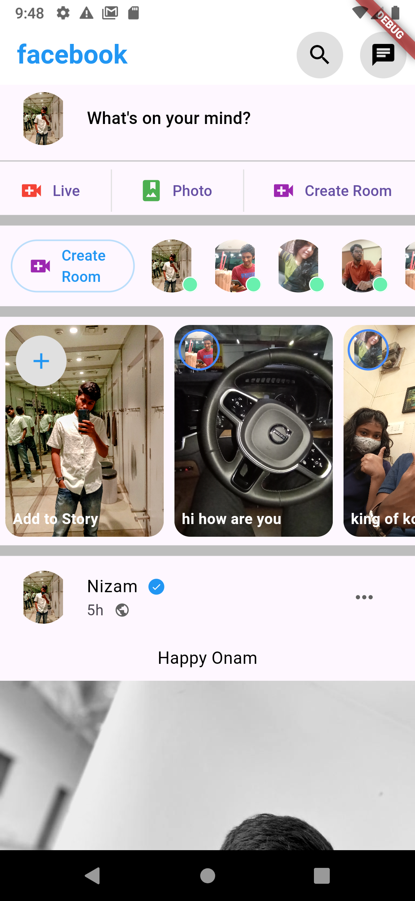

# Facebook Home Page Clone with Flutter


This project is a front-end clone of the Facebook home page developed using Flutter.

## Table of Contents

- [Features](#features)
- [Screenshots](#screenshots)
- [Installation](#installation)
- [Usage](#usage)
- [Contributing](#contributing)
- [License](#license)
- [Contact](#contact)

## Features

- Facebook Home Page UI
- Responsive Design
- Post Feeds
- Like and Comment UI

## Screenshots

Include screenshots or a gif of your app here to show what it looks like.




## Installation

To get started with this project, follow these steps:

1. **Clone the repository:**

   ```sh
   git clone https://github.com/am-niz/facebook_clone.git
   cd facebook_clone
   
2. **Install dependencies**

   flutter pub get

3. **Run the app**
   
   flutter run

## Usage

To use this project, follow these steps:

1. **Navigate the Home Page:**
   - Open the app on your device or emulator.
   - Browse through the post feeds to see the displayed content.
   - Interact with the UI elements for likes and comments (UI only, no backend functionality).

## Contributing

Contributions are welcome! Follow these steps to contribute:

1. **Fork the repository.**
2. **Create a new branch** for your feature or bugfix:
   ```sh
   git checkout -b feature/your-feature-name
3.**Commit your changes**
  git commit -m "Add some feature"
4.**Push to the branch**
  git push origin feature/your-feature-name
5.**Create a new Pull Request**

## License

This project is licensed under the MIT License. See the LICENSE file for details.

## Contact

If you have any questions or feedback, feel free to reach out:

- **Name**: NIZAMUDHEEN MJ
- **Email**: nizamudheenmj@gmail.com
- **GitHub**: [am-niz](https://github.com/am-niz)


